<!-- @format -->

# 개발 워크스테이션 구축 실습

## 1. 실행 환경

- OS: macOS 26.3.1
- Shell: zsh
- Docker: 28.5.2
- Git: 2.51.0

## 2. 수행 체크리스트

[✔] 터미널 조작  
[✔] 권한 실습  
[✔] Docker 설치/점검  
[✔] hello-world 실행  
[✔] 이미지/컨테이너 운영  
[✔] Dockerfile 빌드/실행  
[✔] 포트 매핑  
[✔] 바인드 마운트  
[✔] 볼륨 영속성  
[✔] Git/GitHub 연동  

## 3. 수행 결과

1. 터미널 조작
   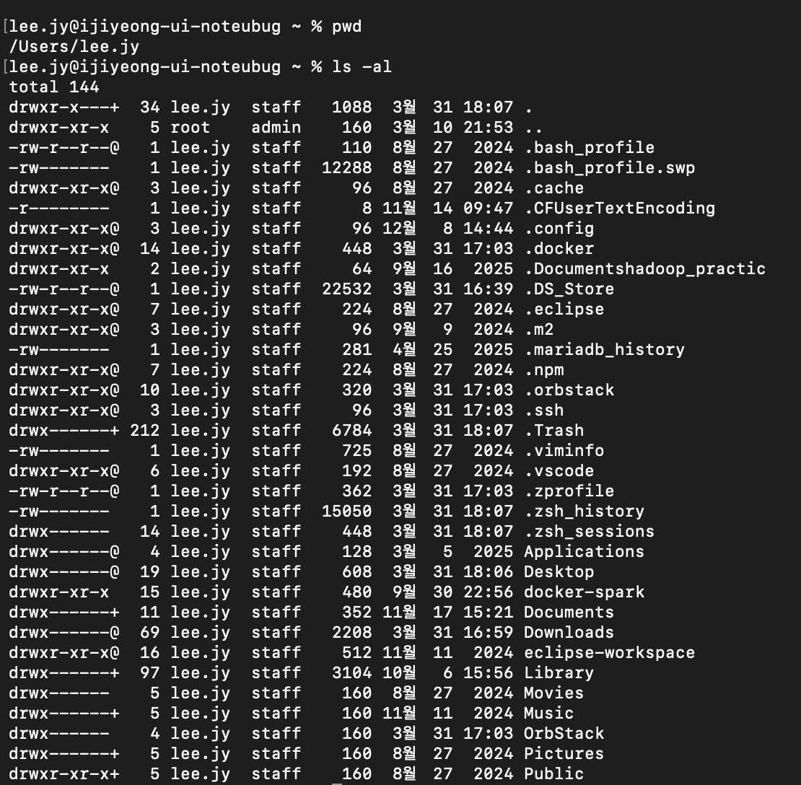
   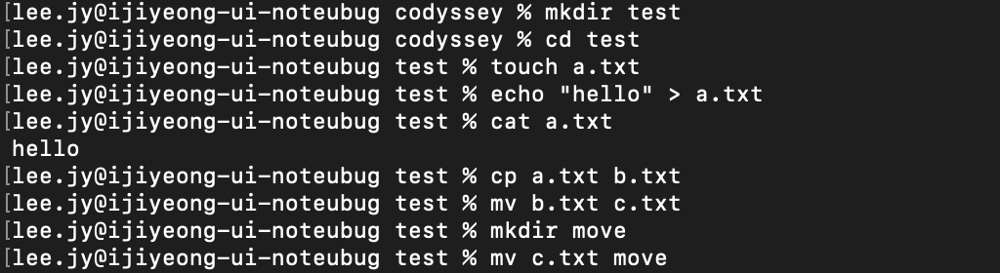
   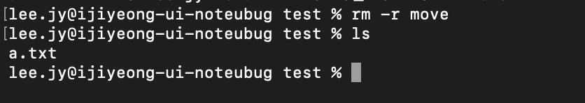
   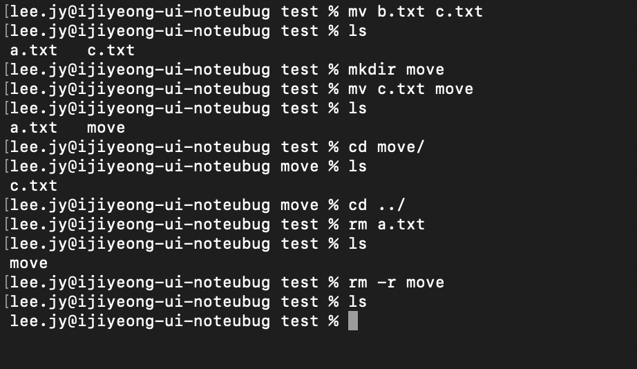

   명령어 간단 설명 :  

   ##### pwd — 현재 작업 중인 디렉토리 위치 확인

   ##### ls — 현재 디렉토리 목록 출력

   ##### ls -al — 숨김 파일 포함, 상세 정보까지 모두 출력

   ##### mkdir 폴더명 — 새 폴더 생성

   ##### cd 폴더명 또는 경로 — 해당 디렉토리로 이동

   ##### touch 파일명 — 비어 있는 파일 생성

   ##### echo "내용" > 파일명 — 파일에 내용 작성 단, 기존 내용이 있어도 적은 내용을 덮어서 저장함

   ##### cat 파일명 — 파일 내용 출력

   ##### cp 원본 대상 — 파일 또는 폴더 복사

   ##### mv 원본 대상 — 파일/폴더 이동 또는 이름 변경

   ##### rm 파일명 — 파일 삭제

   ##### rm -r 폴더명 — 폴더 및 내부 파일 전체 삭제

2. 권한 실습
   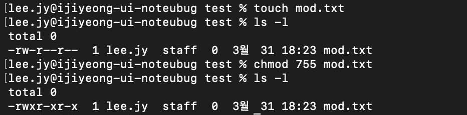
   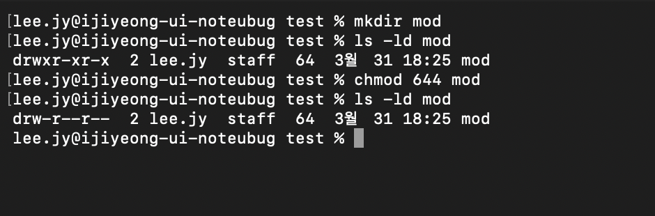

   명령어 간단 설명 :  

   ##### chmod 숫자 대상 - 파일/폴더의 권한을 숫자로 변경 (r=4, w=2, x=1 조합 최대 777(사용자, 그룹, 타인))

3. Docker 설치/점검
   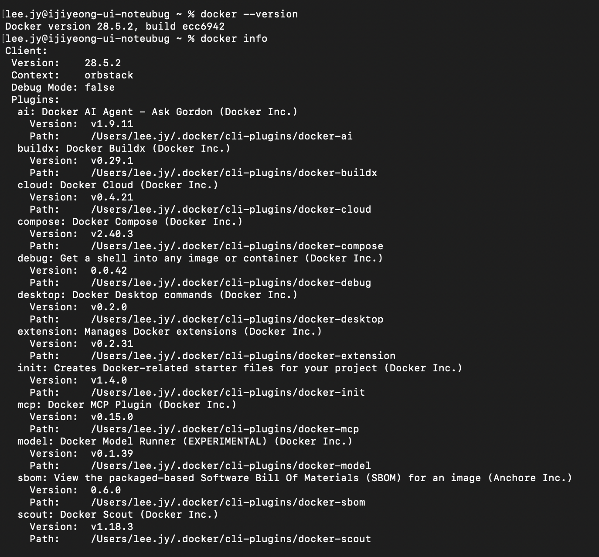
   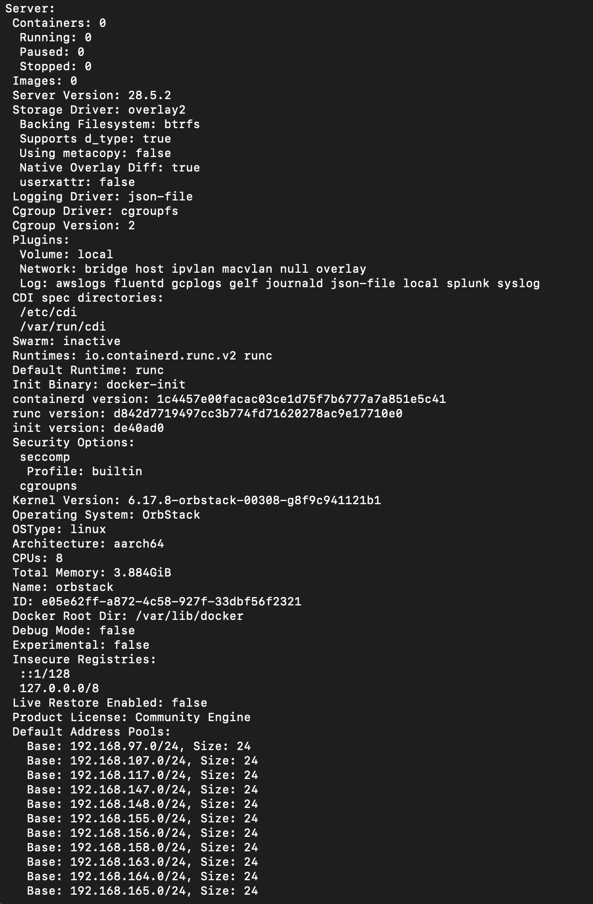
   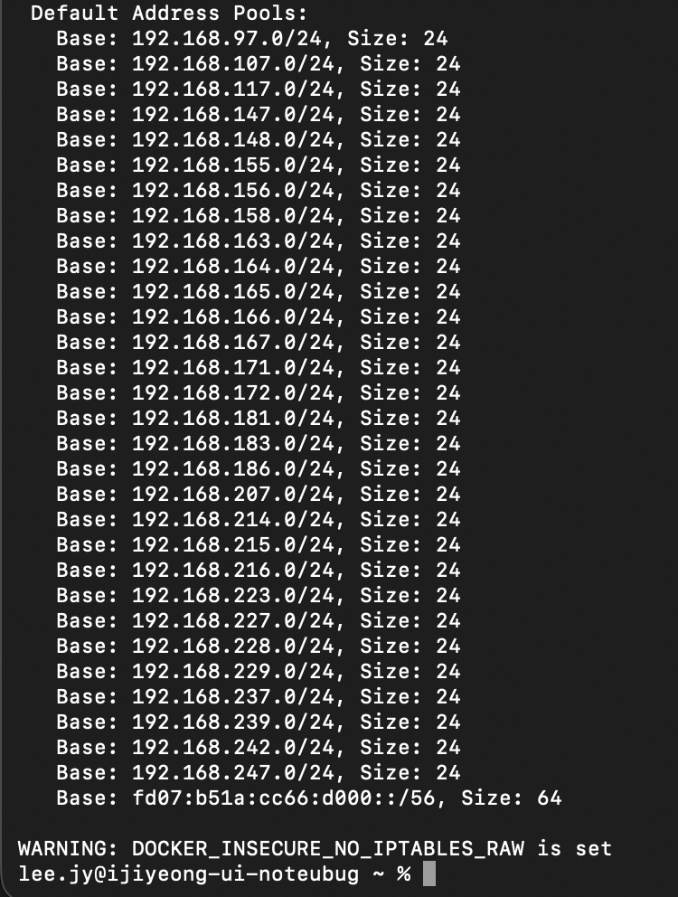

   명령어 간단 설명 :  

   ##### docker --version - 도커 버전 확인

   ##### docker info - 도커 정보 확인

4. hello-world 실행
   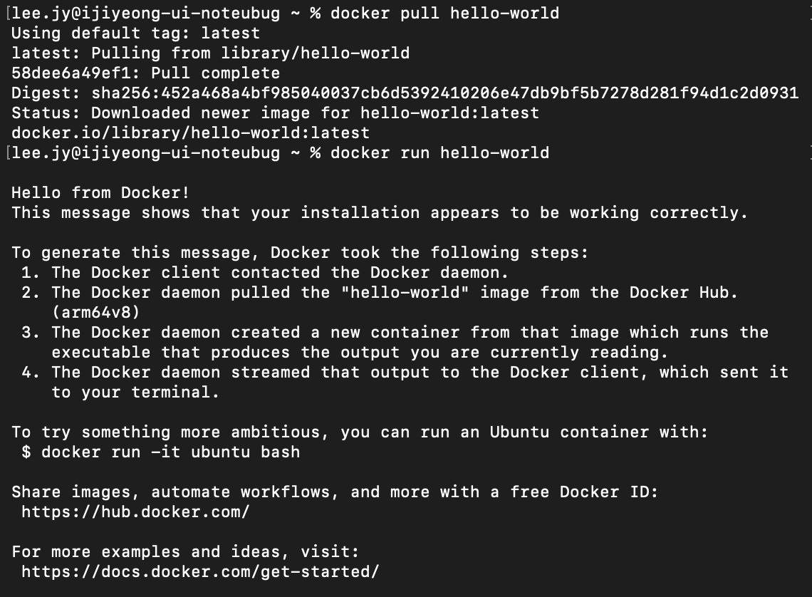

   명령어 간단 설명 :  

   ##### docker pull hello-world - 도커에 hello-world 이미지 다운로드

   ##### docker run hello-world - hello-world 이미지 실행

5. 이미지/컨테이너 운영
   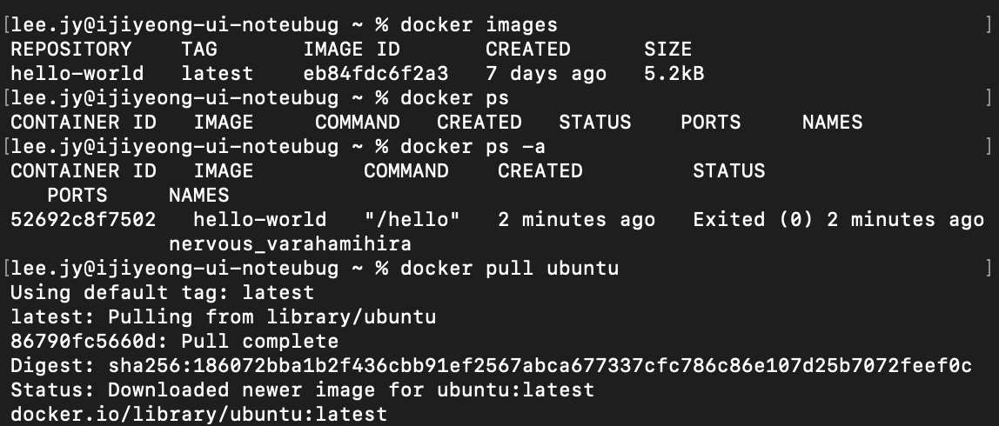
   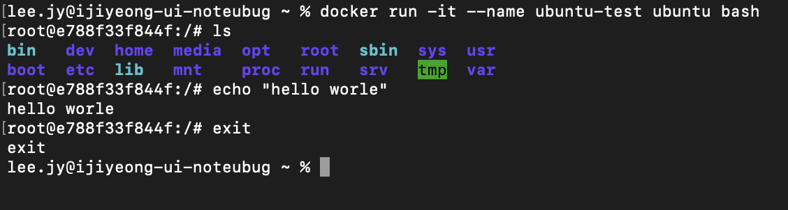
   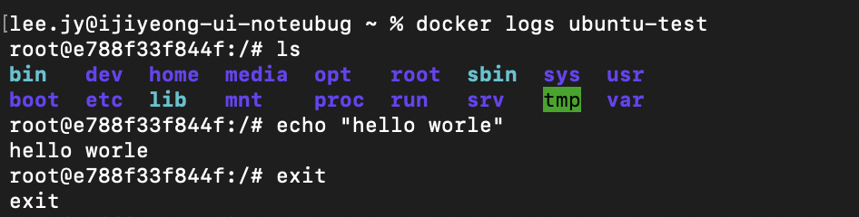
   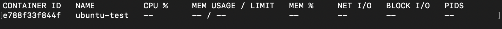

   명령어 간단 설명 :  

   ##### docker images - 다운로드한 이미지 목록 출력

   ##### docker ps - 실행중인 컨테이너 목록 출력

   ##### docker ps -a - 종료된 컨테이너까지 목록 출력

   ##### docker run -it --name 이름 ubuntu bash - 우분투 컨테이너 생성 및 터미널 접속

   ##### echo "내용" - 터미널에 내용 출력

   ##### exit - 컨테이너 빠져나오기

6. Dockerfile 빌드/실행
   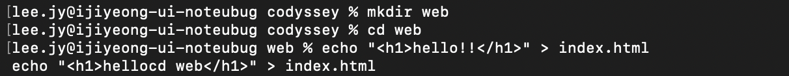
   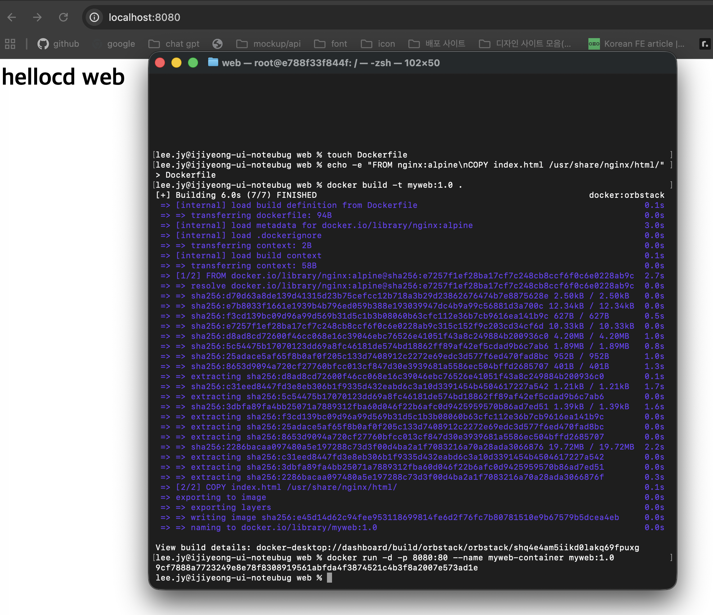

   명령어 간단 설명 :  

   ##### echo -e "FROM nginx:alpine\nCOPY 이름.html /usr/share/nginx/html/" > 파일 - 도커 파일 생성

   ##### docker build -t 이름:1.0 . - 도커파일 이미지 빌드

   ##### docker run -d -p 8080:80 --name 이름-container 이름:1.0 - 컨테이너 백그라운 실행

7. 포트 매핑
   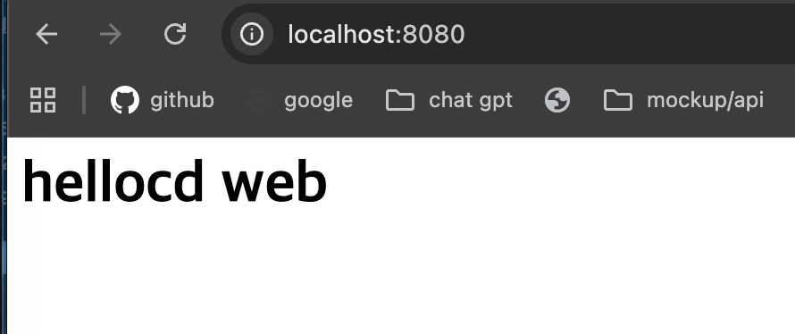

   간단 설명 :  

   ##### 주소창창 빌드한 url를 입력하여 입력한 내용 확인

8. 바인드 마운트
   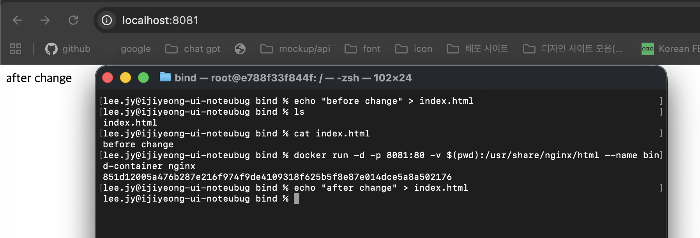

   명령어 간단 설명 :  

   ##### docker run -d -p 8081:80 -v $(pwd):/경로 --name bind-container nginx - 바인드 마운트로 현재 폴더 컨테이너와 연결

9. 볼륨 영속성
   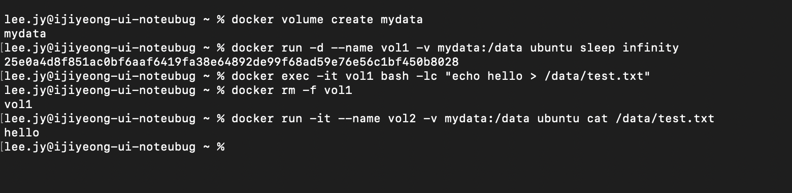

   명령어 간단 설명 :  

   ##### docker volume create 이름 - 도커 볼륨 생성

   ##### docker run -d --name 이름 -v 이름:/data ubuntu sleep infinity - 볼륨 마운트한 우분투 컨테이너 실행

   ##### docker exec -it 이름 bash -lc "echo hello > /data/파일" - 컨테이너 내부아래 데이터 폴더 아ㅐ 파일 작성

   ##### docker rm -f 이름 - 컨테이너 강제 삭제

   ##### docker run it --name 이름 -v 이름:/data ubuntu cat /data/파일 - 볼륨을 연결해 파일 내용 확인

10. Git/GitHub 연동
    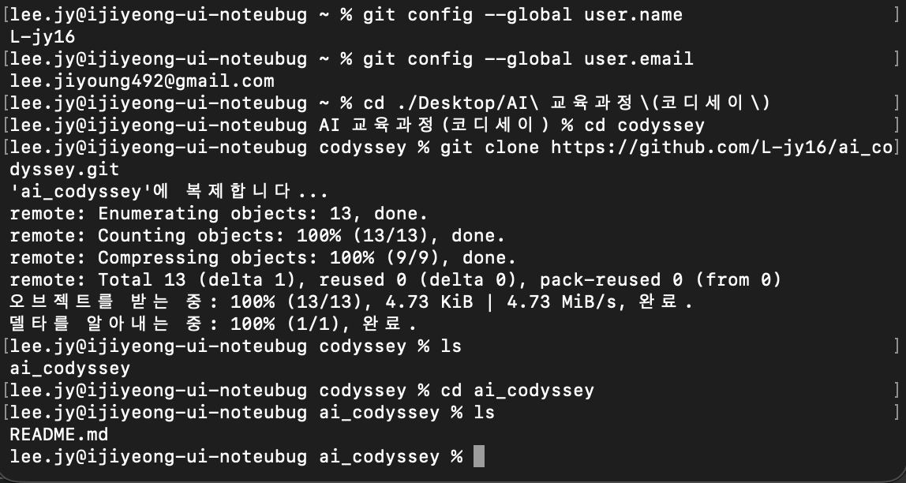
    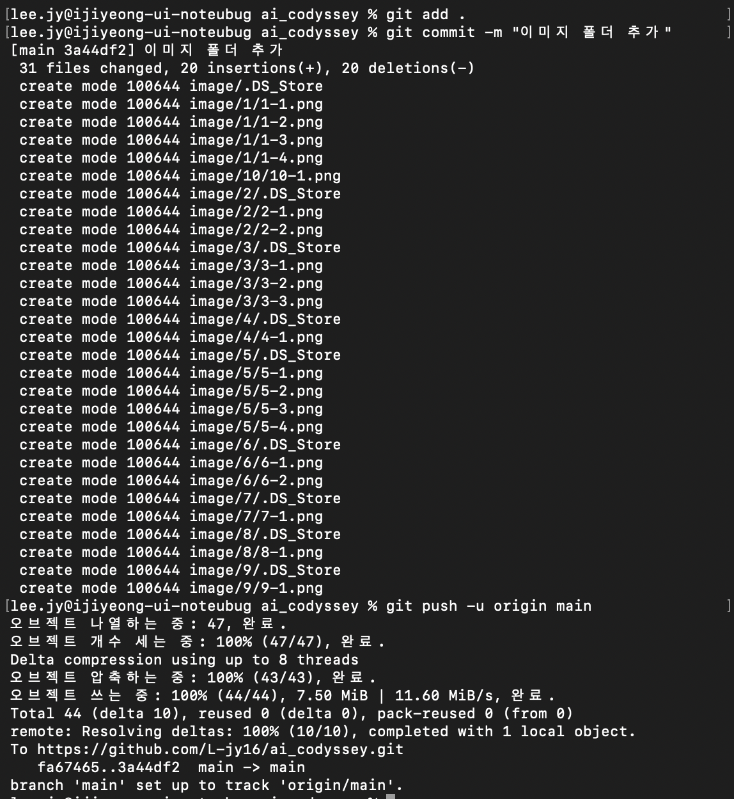
